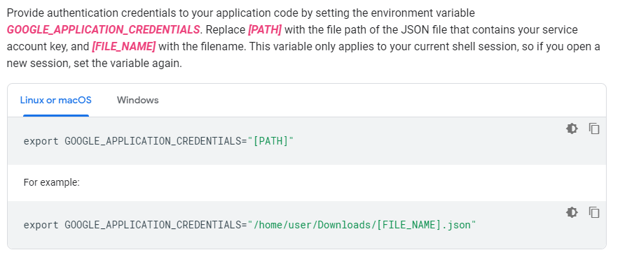

# MyBooksQL

Demo project using GraphQL and Spring boot using Spring Data Reactive Repositories for Cloud Firestore.
This is a simple GraphQL API to perform CRUD operations on the Authors, Books and People entities.

This is a free code so that you can use it as a reference in your projects or even contribute to this code if you wish.

## Getting Started

These instructions will get you a copy of the project up and running on your local machine for development and testing purposes.

### Prerequisites

Follow these [instructions](https://cloud.google.com/firestore/docs/quickstart-servers) until you get to the step of downloading the json key to your computer to create the firestore database in the google cloud and access it from the project. Include this step:

This information is also available in Spanish [here](https://cloud.google.com/firestore/docs/quickstart-servers?hl=es). **_This Google service is free but it has its conditions, I suggest getting information_**

**Note:** If you want to manually set the location of the credentials, modify the _src/main/resources/application.yml_ as follows:

````
spring:
  cloud:
    gcp:
      firestore:
        project-id: [YOUR_GCP_PROJECT_ID]
        credentials:
          location: file:C:\Users\username\Downloads\[FILE_NAME].json
````

### Install

- Clone this repo
```sh
$ git clone https://github.com/AlfredoMarino/my-booksql.git
```
 - Install Java dependencies
```sh
$ cd my-booksql
$ mvn clean install
```
 - Run server
```sh
$ mvn spring-boot:run
```

### Enjoy

Try it in your browser with the following URL http://localhost:8083/graphiql and additionally, I give you a postman collection with some requests to experiment in _postman-collection/MyBooksQL.postman_collection.json_

## Useful information

+ [GraphQL](https://graphql.org/)
+ [Getting Started with GraphQL and Spring Boot | Baeldung](https://www.baeldung.com/spring-graphql)
+ [Spring Data Cloud Firestore](https://github.com/spring-cloud/spring-cloud-gcp/blob/master/docs/src/main/asciidoc/firestore.adoc)
+ [Spring Data Reactive Repositories for Cloud Firestore](https://cloud.spring.io/spring-cloud-static/spring-cloud-gcp/1.2.0.RC1/reference/html/#spring-data-reactive-repositories-for-cloud-firestore)

## Contributing

Pull requests are welcome.

## License

[MIT](https://choosealicense.com/licenses/mit/)